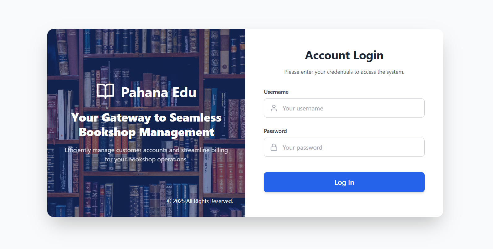
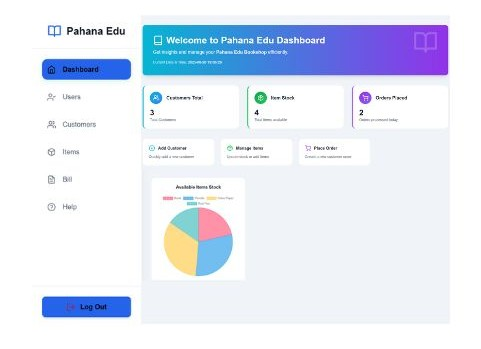
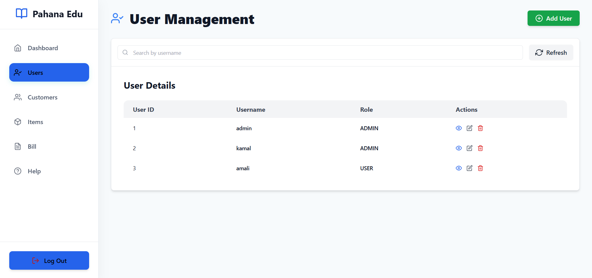
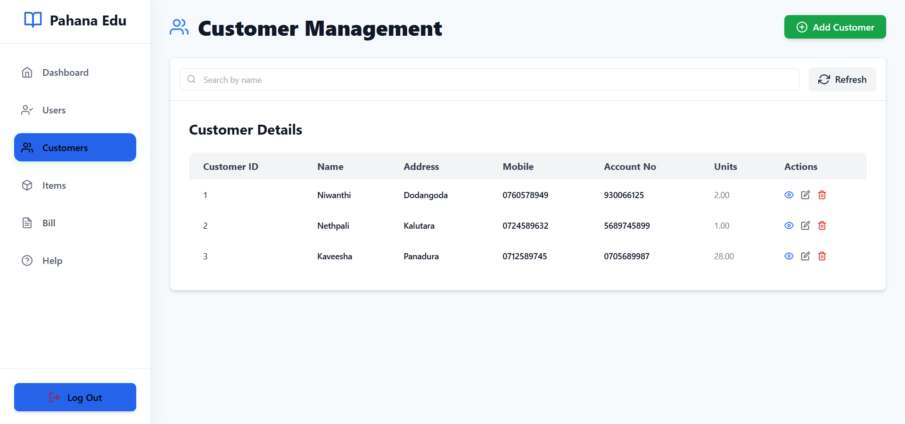
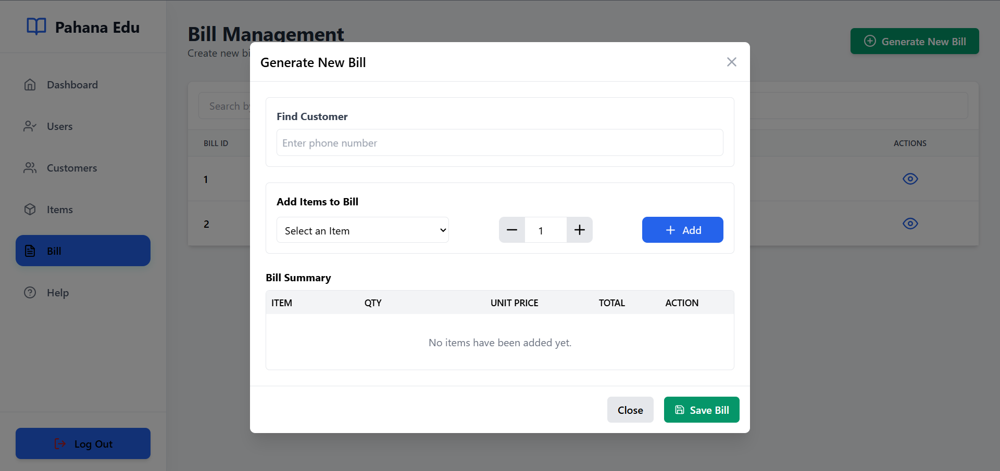
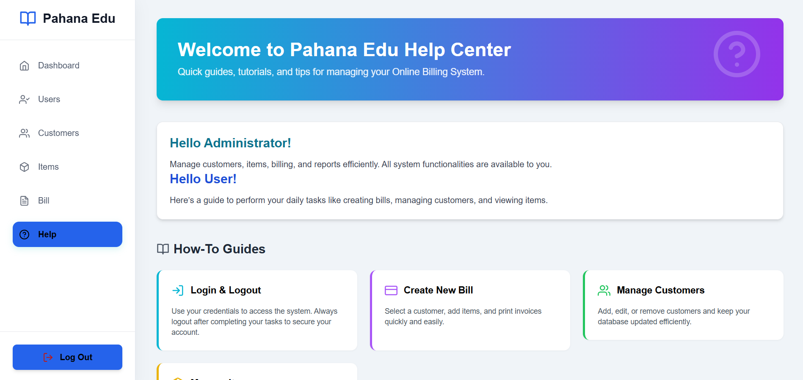

# Online Billing System - Pahana Edu 📚

Welcome to the Online Billing System for Pahana Edu, a modern, computerized solution designed to digitize and automate bookstore management in Colombo City! Built with Java EE, MySQL, and a robust layered architecture, this system streamlines customer management, inventory, and billing, replacing inefficient manual processes with a secure, fast, and reliable platform. 🚀

---

### 🚀 Project Overview

Pahana Edu is a reputed bookstore that previously relied on manual processes for managing customer details and billing. This led to operational inefficiencies, data inconsistencies, and human error. This project delivers a user-friendly, web-based application with a clean administrative interface to manage all core bookstore operations.

> **Objective:** To eliminate manual errors, increase operational efficiency by over 50%, centralize data management, and provide a secure, scalable platform for Pahana Edu's business operations.
>
> **Target Users:** System Admin/Users (bookstore staff).
>
> **Technologies:** Java EE, MySQL, Maven, JUnit, GitHub Actions (CI/CD), Layered Architecture.

---

### ✨ Key Features

**Authentication & Security:**
* Secure login for authorized staff.
* Passwords are hashed before being stored in the database to ensure data security.
* A security filter intercepts all requests to protected pages to manage user sessions.
* Logout feature for secure session termination.

**User Management:**
* Full CRUD (Create, Read, Update, Delete) operations for system user accounts.
* Manage user roles (e.g., ADMIN, USER).

**Customer Management:**
* Complete CRUD functionality for customer profiles.
* Store and manage key customer details like name, address, and account number.
* Search functionality to quickly find customer records.

**Item (Inventory) Management:**
* Full CRUD support for all bookstore items (books, stationery, etc.).
* Manage item details such as unit price and stock quantity.

**Billing Management:**
* Generate new bills for customers in an interactive form.
* Automatically calculate the total amount based on selected items and quantities, eliminating manual errors.
* View past billing records.
* Generate and download a printable PDF receipt for each transaction.

**System Support:**
* A dedicated "Help" section with guides and instructions on how to use the system's features.

**Additional Enhancements:**
* Singleton Design Pattern for efficient database connection management.
* DAO and Service Layer Patterns for a modular and maintainable codebase.
* Test-Driven Development (TDD) approach for robust and reliable code.
* A fully automated CI/CD pipeline for testing and building the application.

---

### 🏗️ Architecture

The system is built on a **Layered Architecture** to promote a clean separation of concerns, making it modular, scalable, and easy to maintain.

* **Presentation Layer:** Java Servlets and JSPs handle user interface rendering and process all incoming HTTP requests.
* **Service Layer:** Contains the core business logic. It coordinates calls to the DAO layer and enforces all business rules (e.g., validating data before saving).
* **DAO (Data Access Object) Layer:** This layer abstracts and encapsulates all access to the database. It provides a clean API to the service layer for data persistence.
* **Data Layer:** A MySQL database is used for reliable and efficient relational data storage.

---

### 💻 Technology Stack

| Component      | Technology                        |
| :------------- | :-------------------------------- |
| **Platform** | Java EE                           |
| **Database** | MySQL                             |
| **Build Tool** | Apache Maven                      |
| **Testing** | JUnit                             |
| **CI/CD** | GitHub Actions                    |
| **Security** | Password Hashing, Security Filters|
| **Frontend** | JSP, CSS                          |

---

### 🚀 Getting Started

**Prerequisites**
* Java Development Kit (JDK)
* MySQL Server
* Apache Maven
* A Java EE compatible server (e.g., Apache Tomcat)
* Git

**Installation**
1.  **Clone the Repository:**
    ```bash
    git clone [https://github.com/your_username/OnlineBillingSystem-PahanaEdu.git](https://github.com/your_username/OnlineBillingSystem-PahanaEdu.git)
    cd OnlineBillingSystem-PahanaEdu
    ```
2.  **Set Up MySQL:**
    * Create a database for the project.
    * Import the schema from the `.sql` file located in the project.
    * Update the `database.properties` file with your MySQL credentials (URL, username, password).

3.  **Build the Project:**
    ```bash
    mvn clean install
    ```

4.  **Run the Application:**
    * Deploy the generated `.war` file (from the `target/` directory) to your Apache Tomcat server.
    * Access the application via `http://localhost:8080/your-app-context`.

---

### 🧪 Testing

The project was developed using a Test-Driven Development (TDD) approach.

* **Test Coverage:** Comprehensive unit tests for the DAO and Service layers.
* **Framework:** JUnit.
* **Execution:** Tests are run automatically as part of the CI/CD pipeline. To run them locally:
    ```bash
    mvn test
    ```
* **Test Reports:** JUnit test results are generated and can be found in the `target/surefire-reports/` directory.

---

### 🔧 CI/CD Pipeline

The project features a complete CI/CD pipeline using **GitHub Actions** to automate testing, building, and deployment, ensuring code quality and stability.

**Branch Strategy:**
* `development`: For developing new features.
* `stage`: Staging environment for integrating and testing features.
* `release`: Pre-production environment for final validation before a release.
* `main`: Contains stable, production-ready code.

**Key Processes:**
* **Merge Validation:** Enforces strict pull request (PR) rules to maintain branch integrity (e.g., PRs to `main` must come from `release`).
* **Unit Testing:** Automatically runs all JUnit tests for the DAO and Service layers on every push and PR.
* **Building:** Compiles the source code and packages the application into a `.war` file using Maven.
* **Deployment:** (Simulated) Automates deployment to different environments based on the source branch.

This pipeline ensures that every change is automatically validated, leading to a more reliable and streamlined development workflow.

---

### 🔒 Security

The system was designed with a security-first approach to protect sensitive business and customer data.

* **Password Hashing:** User passwords are never stored in plaintext. They are salted and hashed using a strong algorithm, ensuring they are secure even if the database is compromised.
* **Security Filter Chain:** A Java EE servlet filter is implemented to intercept all incoming requests to secure areas of the application. It ensures that only authenticated and authorized users can access sensitive functionalities like user management and billing.

---

### 🤝 Contributing

Contributions are welcome! Please follow these steps:
1.  Fork the repository.
2.  Create a feature branch (`git checkout -b feature/AmazingFeature`).
3.  Commit your changes (`git commit -m 'Add some AmazingFeature'`).
4.  Push to the branch (`git push origin feature/AmazingFeature`).
5.  Open a Pull Request.

---

### 🙌 Acknowledgments

* A special thanks to our Advanced Programming module lecturer, Mr. Bhagya, for his guidance and invaluable support.
* Gratitude to the staff at Pahana Edu for providing the project requirements and insights.

---

### 🖼️ Screenshots

| Login Page | Dashboard |
| :---: | :---: |
|  |  |
| **User Management** | **Customer Management** |
|  |  |
| **Billing Page** | **Help Page** |
|  |  |

### 🔗 All Resources

All project resources are available at the links below:

* **[Main Project Repository](https://github.com/Kaushalya13/OnlineBillingSystem-PahanaEdu)**
* **[UML Diagrams & Test Cases](https://drive.google.com/drive/folders/1t5DJIS4gT1jBAgxrCT-1RHNApw1X8Mwx?usp=sharing)**

[//]: # (* **[Project Demonstration Video]&#40;https://your-link-to-the-video.com&#41;**)


---

**Version:** 1.0.0
**Last Updated:** August 21, 2025